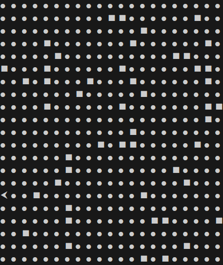

# Mars Rover (Interactive Controls)

A simple Mars Rover simulator with an interactive control mode
Set the plateau size, land a rover with an initial direction, then control it step by step using single-key commands

---

## Requirements

- Python 3.10+ (recommended)
- pip
- A terminal that supports interactive key input

---

## Setup

### 1) Create a virtual environment and install dependencies

From the project root:

```bash
python -m venv .venv
source .venv/bin/activate
pip install -r requirements.txt
```

**Windows (PowerShell):**

```powershell
python -m venv .venv
.\.venv\Scripts\Activate.ps1
pip install -r requirements.txt
```

---

### 2) Activate the environment (if not already activated)

**macOS / Linux:**

```bash
source .venv/bin/activate
```

**Windows (PowerShell):**

```powershell
.\.venv\Scripts\Activate.ps1
```

---

## Run the project

### 3) Run `main.py`

**macOS / Linux / Windows:**

```bash
python main.py
```

---

## How to play

### 4) Set the plateau size

When prompted, enter the plateau size in the following format:

```text
5 5
```

---

### 5) Land the rover

Enter the rover landing position and direction:

```text
1 2 N
```

Where the direction is one of:

- `N` — North
- `E` — East
- `S` — South
- `W` — West

---

### 6) Control the rover (interactive mode)



Once the map is displayed, control the rover using single-key commands:

- `L` — turn left
- `R` — turn right
- `M` — move forward
- `Q` — quit the program

**Example:**

- Press `L` to rotate left
- Press `M` to move forward one step

⚠️ Watch out for rocks — do not crash into obstacles

---

## Notes

- Invalid inputs will display an error message and reprint the map
- Only `L`, `R`, `M` and `Q` are accepted during control mode
